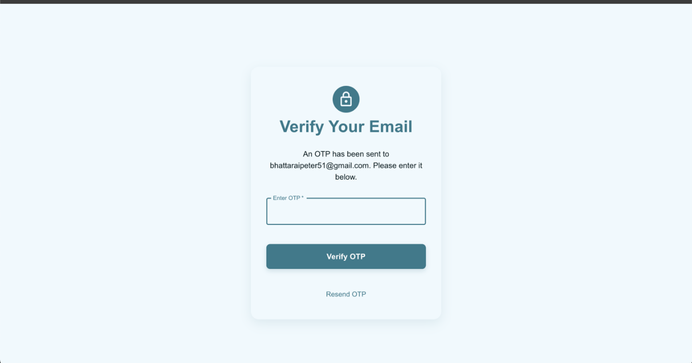
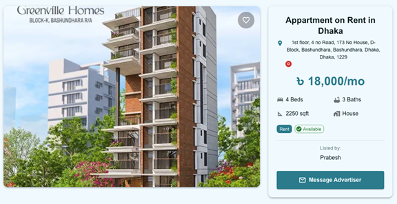
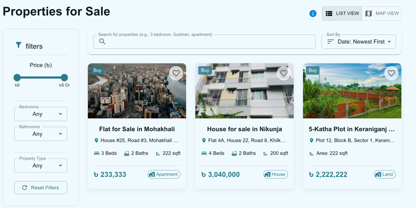
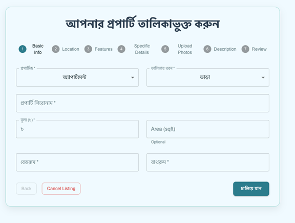
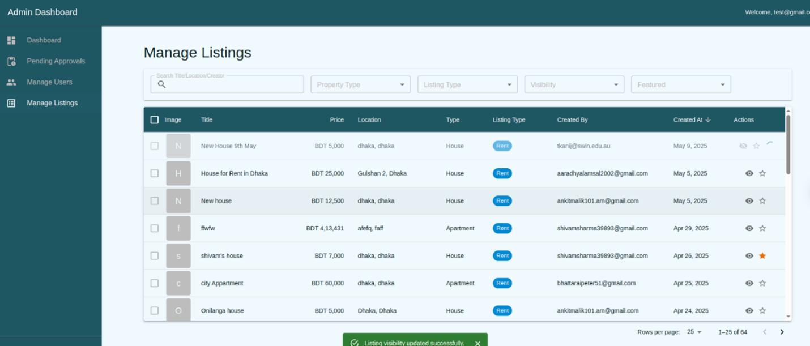
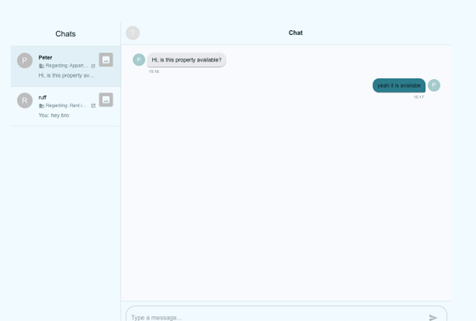
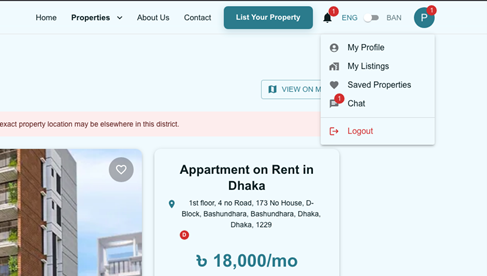
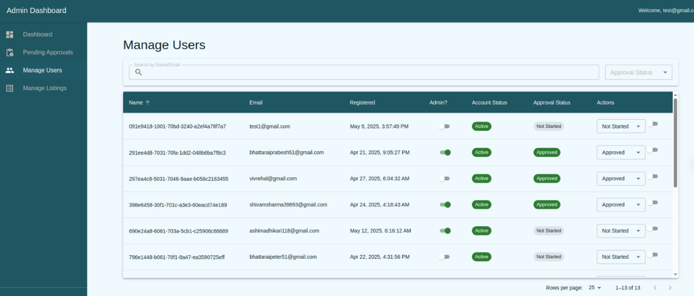
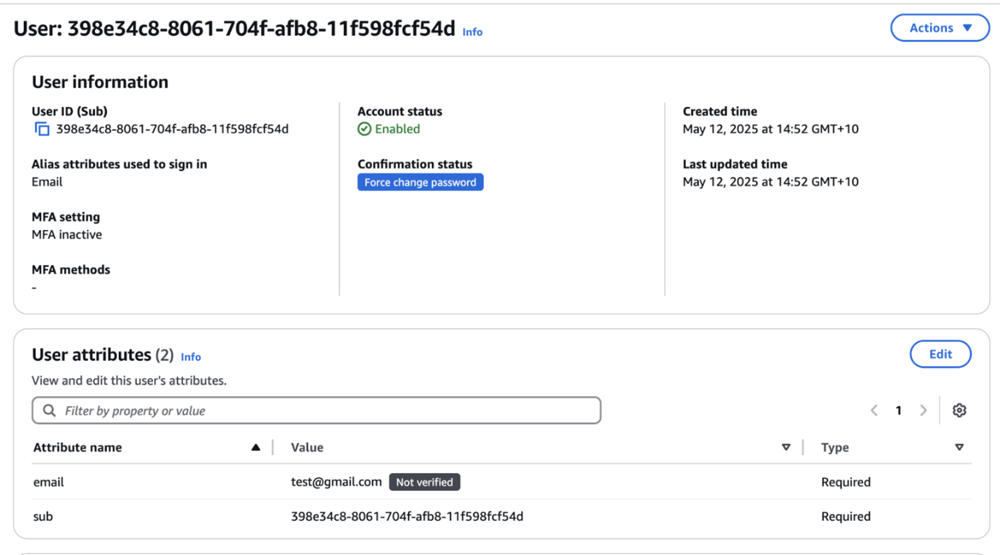

# 🏠 BanglaGhar – Real Estate Platform for Bangladesh

 
 
 
 
 
 


BanglaGhar is a **bilingual web-based real estate platform** tailored for the Bangladeshi property market.  
It connects **property advertisers (landlords)** with **tenants** through a **secure, user-friendly, and localized** experience.  

The platform includes property listings, interactive maps, dual-language support (English & Bangla), real-time chat, AI-generated property descriptions, and an admin dashboard for secure verification and content moderation.  

---

## ✨ Features

### 🏡 Property Listings
- Detailed listings with **price, area, images, amenities, and location** info.
- Editable AI-generated property descriptions (using **NVIDIA AI + Google Translate**).
- **Bangla/English toggle** via `react-i18next`.

### 🔎 Search & Filter
- Filter by **city/area, property type, price, bedrooms, bathrooms, area (sqft)**.
- Interactive **map-based property browsing** using **Leaflet.js + OpenStreetMap**.
- Alert system for inaccurate location data.

### 💬 Real-Time Chat & Notifications
- **Private chat** between tenants and landlords (Ably API).
- In-app **notifications** when receiving new messages.

### 👤 Secure Authentication & User Roles
- OTP-based **email login** with **AWS Cognito**.
- User roles: **Tenant, Landlord, Admin**.
- Admin dashboard for:
  - Approving/rejecting listings.
  - Verifying user NID uploads.
  - Managing users and content.

### 🌐 Bilingual Support
- Seamless **language toggle (English/Bangla)**.
- Improved translation with **Google Translate API** and manual refinements.

---

## 📸 Screenshots

### 🔑 Authentication
  
*Secure OTP-based login using AWS Cognito.*

---

### 🏘️ Property Listings
  
  
*Detailed listings with images, amenities, and price filters.*

---

### 📝 Add & Manage Listings
  
  
*Landlords can post and manage property listings.*

---

### 💬 Communication
  
  
*Real-time chat with in-app notifications.*

---

### 🛠️ Admin & Deployment
  
  
*Admin dashboard for verification and AWS service setup.*

---

## 🛠 Tech Stack

**Frontend:**  
- React.js + Material UI  
- Next.js (for frontend + API routes)  
- Tailwind CSS  

**Backend & Cloud Services:**  
- Node.js + Express  
- Netlify (backend hosting)  
- MongoDB Atlas (database)  
- AWS Cognito (authentication)  
- AWS S3 (file & image storage)  
- AWS Lambda + API Gateway  

**Integrations:**  
- Ably API (real-time chat)  
- NVIDIA AI + Google Translate (property descriptions)  
- Leaflet.js + OpenStreetMap (maps & geolocation)  

---

## ⚙️ Deployment

Deployment follows a **Vercel + Netlify + AWS** setup :contentReference[oaicite:0]{index=0}:

### 🔧 Prerequisites
- GitHub repository access
- Vercel account (for frontend)
- Netlify account (for backend)
- AWS account with:
  - Cognito (user authentication)
  - S3 bucket (image & ID storage)
  - IAM roles
  - Lambda + API Gateway (backend services)

### 🚀 Steps
1. **Clone the repo**  
   ```bash
   git clone <repo-url>
   cd banglaghar
