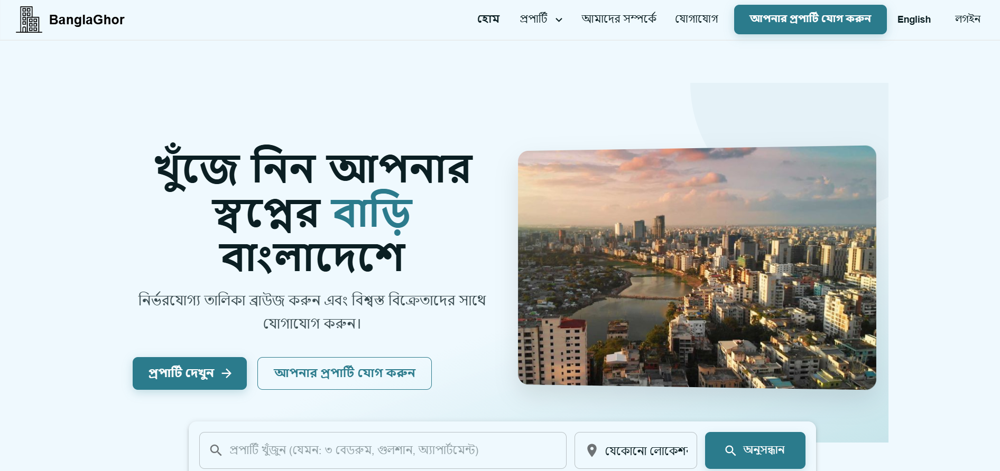
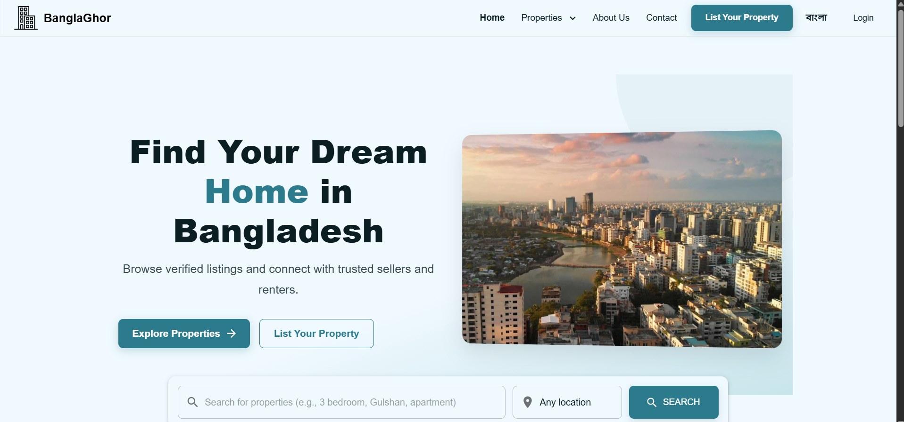
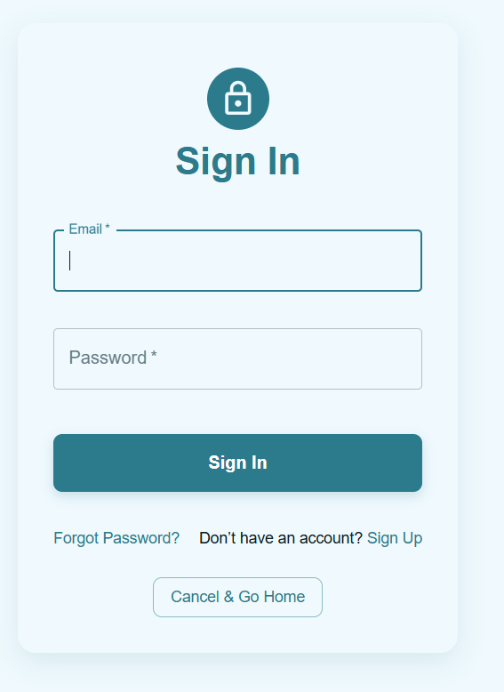
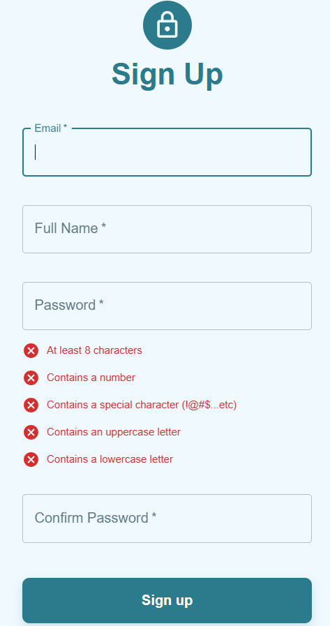

# 🏠 BanglaGhar – Real Estate Platform for Bangladesh

 
 
 
 
 
 

BanglaGhar is a **bilingual web-based real estate platform** tailored for the Bangladeshi property market.  
It connects **property advertisers (landlords)** with **tenants** through a **secure, user-friendly, and localized** experience.  

---

## 🌍 Homepage (Bilingual Support)

Bangla and English versions of the homepage.  

| Bangla Homepage | English Homepage |  
|-----------------|------------------|  
|  |  |  

---

## ✨ Features

- 🏡 Property Listings with filters, images, AI-generated descriptions, and Bangla/English toggle.  
- 🔎 Search & Filter by city, price, property type, rooms, and area.  
- 💬 Real-Time Chat and Notifications (Ably API).  
- 👤 Secure OTP-based Authentication (AWS Cognito).  
- 🛠️ Admin Dashboard for NID verification, listing approval, and user management.  
- 🌐 Bilingual Support (English + Bangla).  

---

## 📸 Screenshots

### 🔑 Authentication  
Full authentication workflow with sign-in, sign-up, and OTP verification.  

| Sign In | Sign Up | OTP Verification |  
|---------|----------|------------------|  
|  |  |  |  

---

### 🏘️ Property Browsing  
Browse properties with a clean UI, filters, and Bangla/English toggle.  

| Property View | Alternative Property Layout |  
|---------------|-----------------------------|  
|  |  |  

---

### 📝 Add & Manage Listings  
Post new properties and manage existing listings.  

| Add New Listing | Manage Listings |  
|-----------------|-----------------|  
|  |  |  

---

### 💬 Communication  
Real-time chat between landlords and tenants, plus notifications for new messages.  

| Chat Window | Notifications |  
|-------------|---------------|  
|  |  |  

---

### 🛠️ Administration & Deployment  
Admin dashboard for secure verification and AWS deployment interface.  

| Admin Dashboard | AWS User Setup |  
|-----------------|----------------|  
|  |  |  

---

## 🛠 Tech Stack

**Frontend:**  
- React.js + Material UI (for frontend and API routes)

**Backend & Cloud Services:**  
- Node.js + Express  
- Netlify (backend hosting)  
- MongoDB Atlas (database)  
- AWS Cognito (authentication)  
- AWS S3 (file & image storage)  
- AWS Lambda + API Gateway  

**Integrations:**  
- Ably API (real-time chat)  
- NVIDIA AI + Google Translate (property descriptions)  
- OpenCageMap (maps & geolocation)  

---

## ⚙️ Deployment

Deployment follows a **Vercel + Netlify + AWS** setup:

1. Clone repo → `git clone <repo-url>`  
2. Configure environment variables on **Netlify** (backend) and **Vercel** (frontend).  
3. Deploy backend (Netlify) → runs via `netlify.toml`.  
4. Deploy frontend (Vercel).  
5. Verify with OTP login, property listings, chat, and admin dashboard.  

---

## 👥 Contributors

| Name | ID | Contributions |
|------|----|---------------|
| Ruffin Remad | 103840173 | UI development, Map API integration, property updates, static page translations, chat UI |
| Ankit Malik | 103531273 | Chat & notifications, AI descriptions, AWS S3/IAM setup, bug fixes |
| Shivam Sharma | 103800575 | Backend for chat, NVIDIA AI integration, translation API |
| Aaradhya Lamsal | 103828166 | UI/UX design, frontend enhancements, map improvements |
| Prabesh Bhattarai | 104085535 | AWS services deployment, Sprint documentation |
| Ashim Adhikari | 104104333 | System architecture docs, Scrum (Jira), OTP in Cognito |
| Nur E Siam | 103842784 | Dual translation feature, UI fixes, final delivery |

---

## 📚 Learning Outcomes

From this project, I (Ruffin) gained valuable technical and professional skills:  
- **Technical:** React.js, Node.js/Express, MongoDB Atlas, AWS Cognito/S3, Ably API, Leaflet/OSM.  
- **Professional:** Agile teamwork, sprint planning, client communication, technical documentation, problem-solving.  

This project has been pivotal in shaping my understanding of **full-stack development** and the challenges of delivering a **production-ready platform** in a team environment.  

---

## 📜 License
This project was developed as part of **COS40006/EAT40006 Engineering Project B** at **Swinburne University of Technology**.  
All rights reserved by the project contributors.
